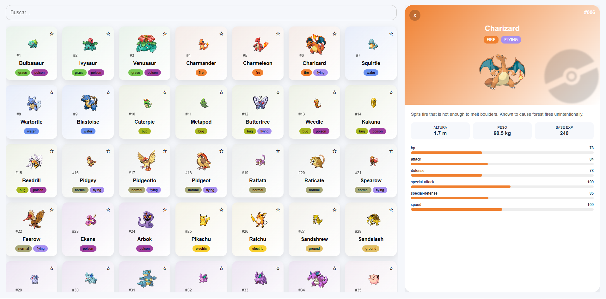
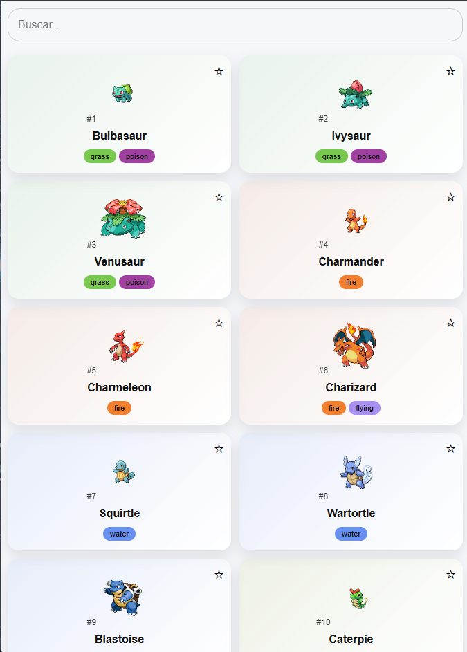
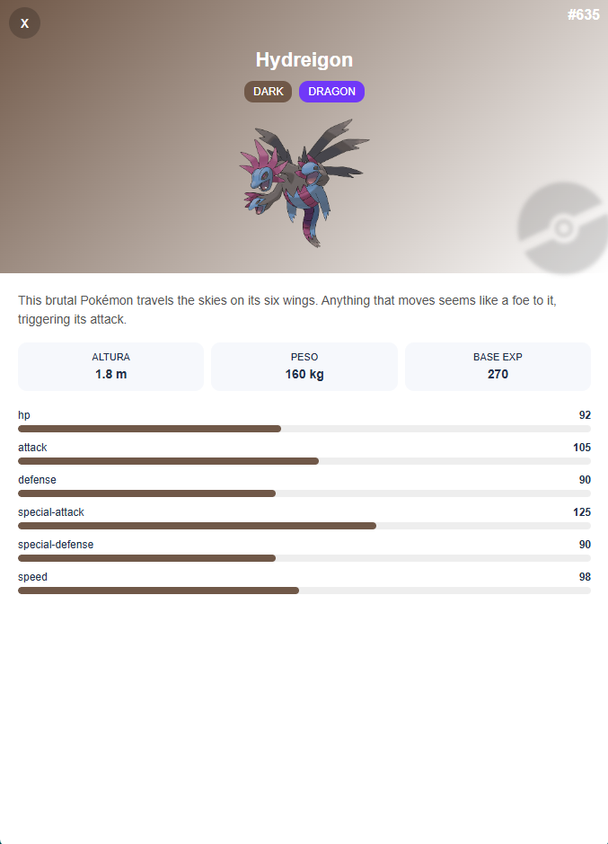

# Pokédex Portfolio

Uma Pokédex interativa construída com React, consumindo a PokéAPI, com foco em performance, UX e organização de dados.


## Demonstração

🔗 [Acessar projeto online](https://gabriel-nasciment0.github.io/pokedex/)

## Imagens

### Desktop



### Mobile




## Tecnologias

- React
- JavaScript (ES6+)
- CSS3
- PokéAPI
- Intersection Observer API

## Funcionalidades

- Listagem de Pokémon com scroll infinito
- Busca em tempo real
- Detalhes completos de cada Pokémon
- Cache de requisições para melhor performance
- Interface responsiva para mobile e desktop
- Layout com painel lateral de detalhes
- Cards dinâmicos com cores baseadas no tipo do Pokémon

## Responsivo

O layout se adapta para telas menores com um painel de detalhes em formato drawer, mantendo a navegação fluida no celular.

## Como rodar localmente

```bash
git clone https://github.com/gabriel-nasciment0/pokedex.git
cd pokedex
npm install
npm start
```
